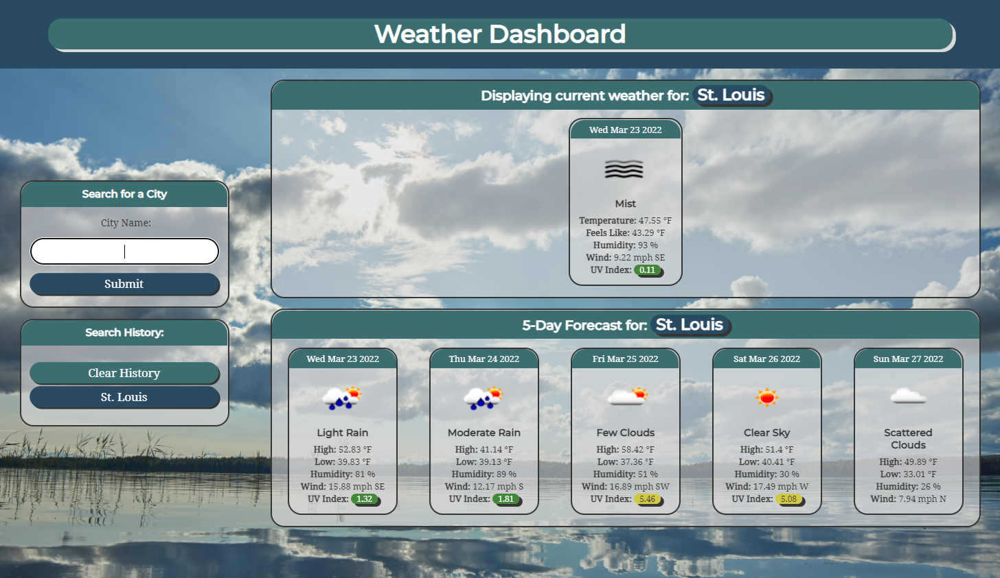
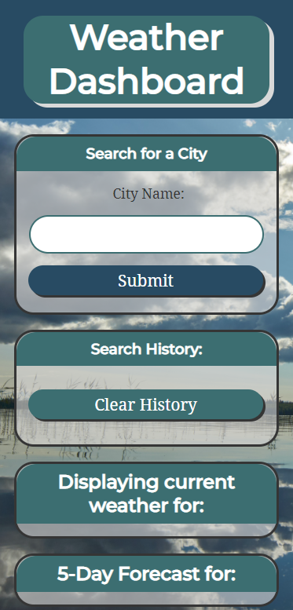

# Weather Dashboard

### What mysteries does the atmosphere hold?

You can see for yourself! This weather application will generate weather for whatever city the user inputs in the search bar using the Open Weather API. Simply enter a city name, then current and future weather conditions for that city will display on the page!

When building this application, I found great ease and intuition in using server-side APIs for the first time. The JSON model for data storage is really satisfying and easy to understand. My greatest challenge when building this application was actually with the CSS and the Vanilla JavaScript. Once the app's codebase grew larger and larger, it was sometimes difficult to track how deeply my data had been embedded within the functions and loops. Resetting the page to display new results was difficult. But once I found the correct variable to reset it was a simple fix. I now feel prepared to build even more complicated applications in the future. 

## Usage and Features

This is how the main page appears to users. The page is responsive, adapting to multiple screen sizes.

When the user clicks enters a city into the form on the left, the current and five-day weather forecast appears on the screen for that city. The header details which city was entered so that the user can see at a glance what city's data is showing. The UV index color changes depending on the severity of the UV rays that day to visually display the data more clearly. Icons repesenting the weather conditions for that day also appear. 

The user can also see their search history displayed on the left side of the screen. If they wish to view that city's weather forecast again, all they need to do is click on the button representing that city. If the user wishes to clear their search results, they simply hit the "clear history" button. 

## Deployed Site

<a href="https://ashlynn4567.github.io/Challenge6-WeatherDashboard/">Click here to track the weather!</a>

## Suggestion Box

In the future, I would like to add the following improvements:

- There is a known bug in this app. When you clear all previous search results, it will result in an error alert showing that the geolocation api cannot be reached.
- I would like to add the ability to delete one search history item at a time rather than deleting all of them.
- It would be awesome if I could incorporate a radar to display on the page for current weather conditions. 

I'm a big believer in always refactoring code to improve it's functionality. If you would like to suggest your own improvements, you can reach me at the following links.

- <a href="mailto:ashlynn4567@gmail.com">Email<a>
- <a href="https://github.com/ashlynn4567">GitHub<a>
- <a href="https://www.linkedin.com/in/ashley-lynn-smith/">LinkedIn</a>

## Credits

Background image from [Wolfgang Hasselmann](https://unsplash.com/photos/bR\_-gllg7Bs).

Special thanks to the [Open Weather OneCall and GeoCoding APIs](https://openweathermap.org/api).

This project was built with the help of the University of Oregon's Coding Boot Camp.
