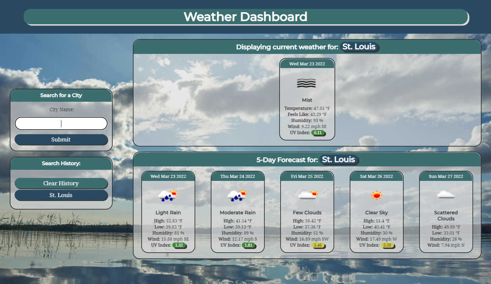

# Weather Dashboard

## Table-of-Contents

- [Description](#description)
- [Deployed Site](#deployed-site)
- [Features](#features)
- [Technologies](#technologies)
- [Future Development](#future-development)
- [Credits](#credits)

## Description

### What mysteries does the atmosphere hold?

You can see for yourself! This weather application will generate weather for whatever city the user inputs in the search bar using the Open Weather API. Simply enter a city name, then current and future weather conditions for that city will display on the page! This page also persistently preserves recent city searches in the sidebar due to localStorage implentation.

## Deployed Site

Follow [this link](https://ashlynn4567.github.io/Weather-Dashboard/) to view and use our site!

## Features

This is how the main page appears to users. The page is responsive, adapting to multiple screen sizes.

When the user clicks enters a city into the form on the left, the current and five-day weather forecast appears on the screen for that city. The header details which city was entered so that the user can see at a glance what city's data is showing. The UV index color changes depending on the severity of the UV rays that day to visually display the data more clearly. Icons repesenting the weather conditions for that day also appear.

The user can also see their search history displayed on the left side of the screen. If they wish to view that city's weather forecast again, all they need to do is click on the button representing that city. If the user wishes to clear their search results, they simply hit the "clear history" button.

## Technologies

- HTML
- CSS
- JavaScript

## Future Development

In the future, I would like to add the following improvements:

- There is a known bug in this app. When you clear all previous search results, it will result in an error alert showing that the geolocation api cannot be reached.
- I would like to add the ability to delete one search history item at a time rather than deleting all of them.
- It would be awesome if I could incorporate a radar to display on the page for current weather conditions.

I'm always interested in refactoring code to improve it's functionality. If you would like to suggest your own improvements, you can reach our development team at the links below.

- <a href="mailto:ashlynn4567@gmail.com">Email</a>
- <a href="https://github.com/ashlynn4567">GitHub</a>
- <a href="www.linkedin.com/in/Ashley-Lynn-Smith">LinkedIn</a>

## Credits

This project was built with the help of the University of Oregon's Coding Boot Camp.

## Licensing

The application is covered under the following license: [MIT](https://opensource.org/licenses/MIT)
